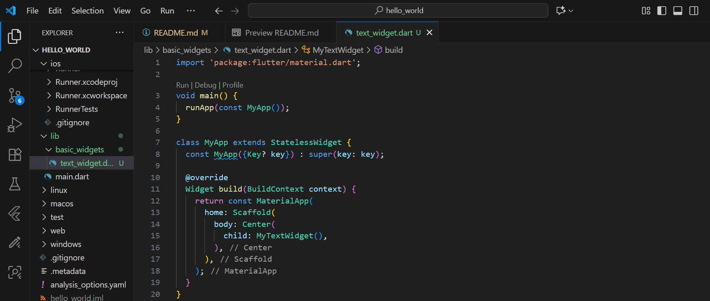
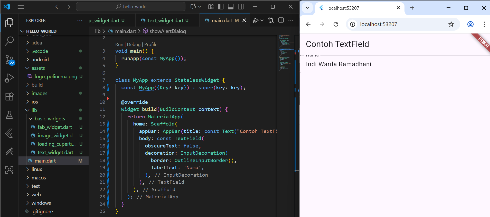
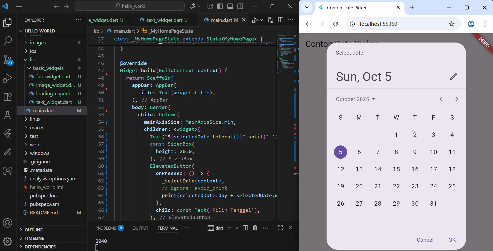

Nama: Indi Warda Ramadhani
 NIM: 2341760026
 Kelas: SIB 3D
 Mata Kuliah: Pemrograman Mobile

Praktikum 1: Membuat Project Flutter Baru
  1. Buka VS Code, tekan Ctrl + Shift + P, ketik Flutter, lalu pilih New Application Project.

  2. Buat pada folder Pemograman Mobile, lalu pilih Select a folder to create the project in.

  3. Ketik nama project hello_world, tekan Enter, lalu tunggu hingga proses selesai.

  4. Jika proses selesai, akan muncul pesan **'Your Flutter Project is ready!'** sebagai tanda project baru berhasil dibuat.

 Praktikum 2: Menghubungkan Perangkat Android atau Emulator
Melanjutkan dari praktikum 1, Anda diminta untuk menjalankan aplikasi ke perangkat fisik (device Android atau iOS). Silakan ikuti langkah-langkah pada codelab tautan berikut ini.

https://developer.android.com/codelabs/basic-android-kotlin-compose-connect-device?hl=id#0

Praktikum 3: Membuat Repository GitHub dan Laporan Praktikum

1. Buat repository baru dengan nama "flutter-fundamental-part1

2. Klik tombol Create repository , lalu akan muncul tampilan seperti gambar berikut.

3. Kembali ke VS Code pada project hello_world, buka Terminal > New Terminal, lalu ketik perintah untuk inisialisasi git.

4. Beri pesan commit "tambah gitignore" lalu klik Commit (✔)

5. Lakukan push dengan klik bagian menu titik tiga > Push

6. Salin tautan repository Anda dari browser ke bagian ini, lalu klik Add remote

8. Setelah berhasil, tulis remote name dengan "origin"

9. Commit juga pada README

10. Setelah itu berhasil tampil kedua file yang di push

11. Lakukan push juga untuk semua file lainnya dengan pilih Stage All Changes. Beri pesan commit "project hello_world". Maka akan tampil di repository GitHub seperti berikut.

12. Kembali ke VS Code, ubah platform di pojok kanan bawah ke emulator atau device atau bisa juga menggunakan browser Chrome. Lalu coba running project hello_world dengan tekan F5 atau Run > Start Debugging. Tunggu proses kompilasi hingga selesai, maka aplikasi flutter pertama akan tampil seperti berikut.

13. Silakan screenshot seperti pada Langkah 11, namun teks yang ditampilkan dalam aplikasi berupa nama lengkap Anda. Simpan file screenshot dengan nama 01.png pada folder images (buat folder baru jika belum ada) di project hello_world Anda. Lalu ubah isi README.md seperti berikut, sehingga tampil hasil screenshot pada file README.md. Kemudian push ke repository. 

Praktikum 4: Menerapkan Widget Dasar

1. Buat folder lib/basic_widgets, lalu file text_widget.dart. Salin kode berikut ke file tersebut pada project hello_world.

Import text_widget.dart ke main.dart, ganti bagian Text widget dengan kode tersebut. Jalankan project, screenshot hasilnya, lalu buat laporan di README.md.

2. Buat file image_widget.dart di folder lib/basic_widgets, lalu isi dengan kode berikut

Lakukan penyesuaian asset pada file pubspec.yaml dan tambahkan file logo Anda di folder assets project hello_world.

Jangan lupa sesuaikan kode dan import di file main.dart kemudian akan tampil gambar seperti berikut.

Praktikum 5: Menerapkan Widget Material Design dan iOS Cupertino

1. Buat file loading_cupertino.dart di basic_widgets, import `material` dan `cupertino`, lalu isi `build` dengan kode berikut:

2. Buat file fab_widget.dart di basic_widgets, import `material`, lalu isi `build` dengan kode untuk tombol FloatingActionButton.

3. Ubah isi main.dart dengan kode berikut untuk menggunakan Scaffold sesuai Material Design:

4. Ubah isi main.dart dengan kode berikut untuk menampilkan AlertDialog dan SimpleDialog:

5. Flutter menyediakan widget input seperti Checkbox, Date/Time Picker, Radio, Slider, Switch, dan TextField. Contoh penggunaan TextField:

6. Date dan Time Pickers termasuk widget input & selection. Contoh penggunaannya:

